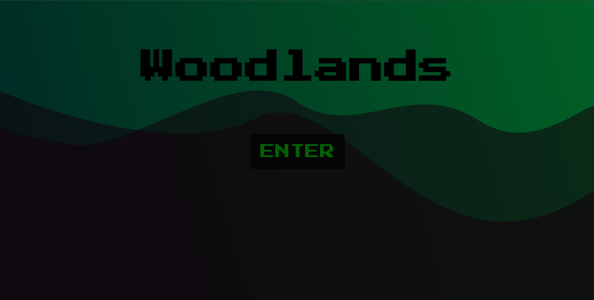

#### The README file for project "woodlands".

#### Author: Sabina Andersson

## THE PROJECT 

This was a school assignment made for Medieistitutet Gothenburg Front End Developer in November 2021.

A click based website where the user can interact with the world of Woodland and story through various choices.
The main character is a cat warrior taken on a weird adventure. All choices made lead to different scenarios and results. 

### Files to be seen:

- index.html with some very basic and minimalistic HTML.
- script.js where all functions and objects are to be found.
All "scenes/pages" are rewritten every time a button is clicked, which means the majority of the HTML is written directly into the JS file. 
- style.css for animations, graphics and styling.

I've chosen to focus on making this website look very cool, and therefor It's not fully responsive yet. 
The story is not finished, and will be a work in progress. 

All graphics and illustrations is made by me in Adobe Illustrator for a more unique and in depth design.

### GITHUB

#### GITHUB DEMO

https://sabinaander.github.io/Woodlands/

<i>Note: the images are not visible in the DEMO, and therefor looks a bit boring.</i>

#### GITHUB REPO

https://github.com/sabinaander/woodlands

